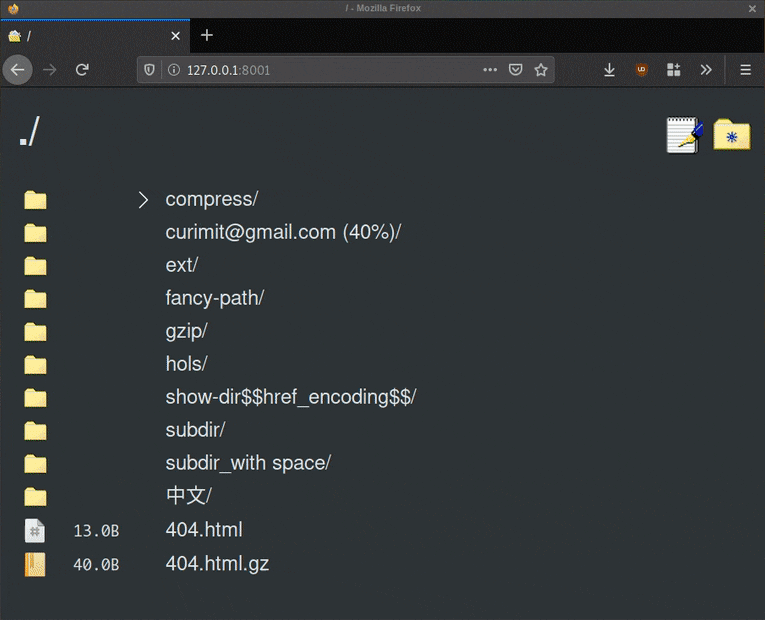

<!--
NOTA: Este README foi creado automáticamente por <https://github.com/YunoHost/apps/tree/master/tools/readme_generator>
NON debe editarse manualmente.
-->

# Gossa para YunoHost

[](https://ci-apps.yunohost.org/ci/apps/gossa/)  

[](https://install-app.yunohost.org/?app=gossa)

*[Le este README en outros idiomas.](./ALL_README.md)*

> *Este paquete permíteche instalar Gossa de xeito rápido e doado nun servidor YunoHost.*  
> *Se non usas YunoHost, le a [documentación](https://yunohost.org/install) para saber como instalalo.*

## Vista xeral

A fast and simple webserver for your files, that's dependency-free and with under 250 lines of code, easy to review.

### Features

    🔍 files/directories browser & handler
    📩 drag-and-drop uploader
    🥂 fast golang static server
    💾 90s web UI that prints in milliseconds
    📸 video streaming & picture browser
    ✍️ simple note editor
    ⌨️ keyboard navigation
    🚀 lightweight and dependency free codebase
    🔒 >95% test coverage and reproducible builds
    💑 easy multi account setup, read-only mode
    ✨ PWA enabled


**Versión proporcionada:** 1.1.2~ynh2

## Capturas de pantalla



## Documentación e recursos

- Repositorio de orixe do código: <https://github.com/pldubouilh/gossa>
- Tenda YunoHost: <https://apps.yunohost.org/app/gossa>
- Informar dun problema: <https://github.com/YunoHost-Apps/gossa_ynh/issues>

## Info de desenvolvemento

Envía a túa colaboración á [rama `testing`](https://github.com/YunoHost-Apps/gossa_ynh/tree/testing).

Para probar a rama `testing`, procede deste xeito:

```bash
sudo yunohost app install https://github.com/YunoHost-Apps/gossa_ynh/tree/testing --debug
ou
sudo yunohost app upgrade gossa -u https://github.com/YunoHost-Apps/gossa_ynh/tree/testing --debug
```

**Máis info sobre o empaquetado da app:** <https://yunohost.org/packaging_apps>
