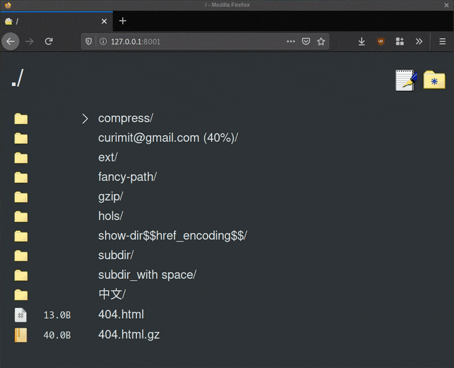

<!--
To README zostało automatycznie wygenerowane przez <https://github.com/YunoHost/apps/tree/master/tools/readme_generator>
Nie powinno być ono edytowane ręcznie.
-->

# Gossa dla YunoHost

[](https://ci-apps.yunohost.org/ci/apps/gossa/)


[](https://install-app.yunohost.org/?app=gossa)

*[Przeczytaj plik README w innym języku.](./ALL_README.md)*

> *Ta aplikacja pozwala na szybką i prostą instalację Gossa na serwerze YunoHost.*  
> *Jeżeli nie masz YunoHost zapoznaj się z [poradnikiem](https://yunohost.org/install) instalacji.*

## Przegląd

A fast and simple webserver for your files, that's dependency-free and with under 250 lines of code, easy to review.

### Features

    🔍 files/directories browser & handler
    📩 drag-and-drop uploader
    🥂 fast golang static server
    💾 90s web UI that prints in milliseconds
    📸 video streaming & picture browser
    ✍️ simple note editor
    ⌨️ keyboard navigation
    🚀 lightweight and dependency free codebase
    🔒 >95% test coverage and reproducible builds
    💑 easy multi account setup, read-only mode
    ✨ PWA enabled


**Dostarczona wersja:** 1.1.2~ynh2

## Zrzuty ekranu



## Dokumentacja i zasoby

- Repozytorium z kodem źródłowym: <https://github.com/pldubouilh/gossa>
- Sklep YunoHost: <https://apps.yunohost.org/app/gossa>
- Zgłaszanie błędów: <https://github.com/YunoHost-Apps/gossa_ynh/issues>

## Informacje od twórców

Wyślij swój pull request do [gałęzi `testing`](https://github.com/YunoHost-Apps/gossa_ynh/tree/testing).

Aby wypróbować gałąź `testing` postępuj zgodnie z instrukcjami:

```bash
sudo yunohost app install https://github.com/YunoHost-Apps/gossa_ynh/tree/testing --debug
lub
sudo yunohost app upgrade gossa -u https://github.com/YunoHost-Apps/gossa_ynh/tree/testing --debug
```

**Więcej informacji o tworzeniu paczek aplikacji:** <https://yunohost.org/packaging_apps>
